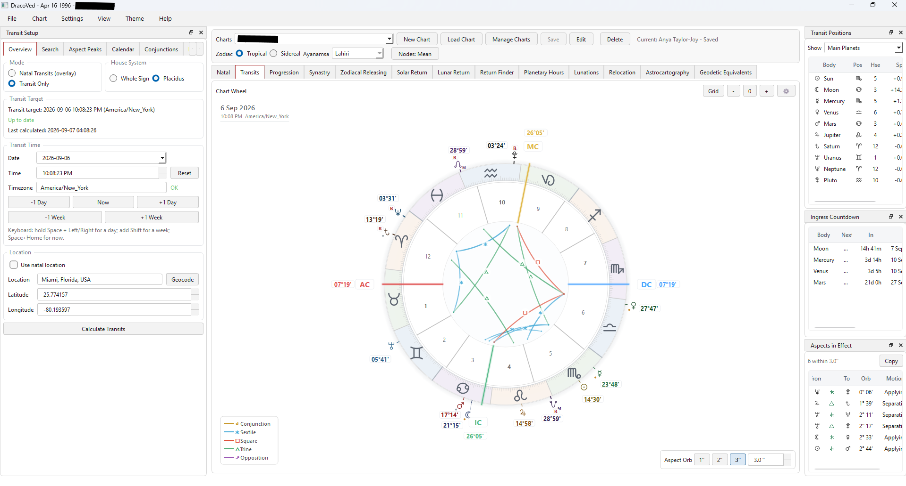

# DracoVed C++



DracoVed is a native Windows astrology research application built with **C++20, Qt 6, and Swiss Ephemeris**. It brings natal charts, transit searches, return charts, progressions, relationship comparisons, traditional timing techniques, and geographic research into one desktop workspace.

Charts, aspect tables, selected-event details, and copyable reports share the same workspace. Tropical and sidereal calculations are supported, with controls for house systems, ayanamsa, lunar nodes, and chart visibility.

## Contents

- [Features](#features)
- [Getting started](#getting-started)
- [Research workflows](#research-workflows)
- [Build and package on Windows](#build-and-package-on-windows)
- [Runtime files and saved data](#runtime-files-and-saved-data)
- [Architecture](#architecture)
- [Troubleshooting](#troubleshooting)
- [Development and validation](#development-and-validation)
- [Licensing](#licensing)

## Features

### Charts and presentation

- **Tropical and sidereal zodiacs**, with Lahiri, Raman, Krishnamurti, Fagan/Bradley, Yukteshwar, True Citra, True Revati, and Pushya-paksha ayanamsas.
- **Whole Sign and Placidus houses**, subject to the requirements of the selected technique.
- **Mean nodes, true nodes, or both**, with a primary-node choice when both are displayed and support for chart-specific settings.
- Planets, selected asteroids, lunar nodes, angles, Vertex, Arabic Lots, Part of Fortune, and fixed stars.
- Interactive chart wheels with zoom, pan, overlays, aspect lines, tooltips, and body highlighting.
- Visibility controls, readability presets, glyphs, adjustable text, and collision-aware placement of dense labels.
- Light, Dark, and Creme themes; rearrangeable dock panels; configurable aspect orbs.
- Saved chart profiles, chart management, and clipboard reports.

### Workspaces

| Workspace | Capabilities |
| --- | --- |
| **Natal** | Birth chart, placements, angles, houses, fixed stars, aspect matrix, and natal report. |
| **Transits** | Current or selected-time charts, natal overlays, event searches, aspect peaks, calendars, conjunctions, Best Days scans, and profections. |
| **Progression** | Secondary progressions, natal comparisons, and previous/next progressed lunar returns. |
| **Synastry** | Compare the active chart with a second saved or manually entered chart using Western cross-aspects and reciprocal-contact marking. |
| **Zodiacal Releasing** | Release from Spirit, Fortune, or Eros; explore up to four period levels, active chains, and timing markers. |
| **Solar Return** | Standard solar returns, Tajaka Varshaphala, natal comparisons, technique views, placement searches, and configurable reports. |
| **Lunar Return** | Previous/next return navigation, natal comparisons, and lunar-return placement searches. |
| **Return Finder** | Search solar or lunar returns with reusable conditions and presets; inspect matches and open their charts. |
| **Planetary Hours** | Sunrise-to-sunrise planetary days, day/night hour intervals, rulers, and the active hour. |
| **Lunations** | New/full moons and eclipse searches, degree filters, conjunction filters, and degree-group analysis. |
| **Relocation** | Recalculate a chart for another location and compare it with the natal chart. |
| **Astrocartography** | Interactive geographic lines with natal or progressed chart sources and location inspection. |
| **Geodetic Equivalents** | Geographic angle calculations, map overlays, and contacts at a selected location. |

Western aspect synastry is implemented; Vedic Ashtakoota is reserved in the code but is not implemented. Reports can be copied into external research tools; the current application source does not include a direct AI-service integration.

## Getting started

If you already have a packaged runtime, keep its files together and launch:

```text
dracoved_app/dist/dracoved_app.exe
```

If you have source only, follow [Build and package on Windows](#build-and-package-on-windows) first.

### Create your first chart

1. Choose **New Chart** in the chart toolbar, or press **Ctrl+N**.
2. Enter the name, birth date, local birth time, location, coordinates, and timezone. Location search can fill coordinates and request a timezone lookup; coordinates and timezone can also be entered manually.
3. Choose the house system and calculate the chart.
4. Use the zodiac toolbar to choose Tropical or Sidereal and, when relevant, an ayanamsa. Review the lunar-node policy in the toolbar or preferences.
5. Inspect the **Summary**, **Angles**, **Planets**, **Fixed Stars**, **Houses**, and **Report** panels, alongside the wheel and aspects.
6. Save the chart as a profile for later use or comparison.

Timezone input accepts zone IDs such as `Asia/Dhaka`, `UTC`, and fixed offsets such as `UTC+06:00`. Use a named timezone when you want its date-dependent timezone rules; a fixed offset represents the same offset throughout the year.

### Work with the shared view

Selecting a research result updates the chart and relevant detail panes in supported workflows. Check the selected row and displayed date before copying a report. After changing calculation inputs, use the workspace's Calculate or Run control when the status indicates that results need refreshing.

Use chart display settings to reduce visible bodies, lots, stars, or aspect lines when the wheel is crowded. These controls make dense charts easier to inspect.

## Research workflows

### Transit research

The Transits workspace contains seven subtabs:

| Subtab | Use it to |
| --- | --- |
| **Overview** | Inspect transits at a selected moment, current aspects, and ingress countdowns. |
| **Search** | Find sign/house ingress or egress, aspects, degree hits, and stations; search a range or navigate to the next/previous event. |
| **Aspect Peaks** | Search for peaks in transit aspect activity and inspect the resulting moments. |
| **Calendar** | Browse planetary sign changes and optional house changes over a date range. |
| **Conjunctions** | Search selected planets for conjunctions or sign/house groupings with a minimum participant count. |
| **Best Days** | Scan a range using the available scoring controls and inspect ranked results. |
| **Profections** | Inspect annual profection age, sign, house, and ruler information. |

For an exact pair conjunction search, select exactly two planets and set the minimum count to two. This activates exact pair mode and disables the orb controls. Larger group searches use the available grouping/orb settings.

Search, Calendar, Conjunctions, Best Days, and Lunations provide selected-event detail copying. Use the relevant copy control after selecting a result.

### Return Finder

1. Load the natal chart that supplies the reference data.
2. Choose Solar or Lunar returns and the search range.
3. Set the location, house mode, and whether **all** or **any** enabled conditions must match.
4. Add conditions for planet placements, aspects, house-lord placements, profection-lord placements, or stelliums. Conditions can also exclude matches.
5. Run the search, select a result to inspect its condition evaluations, and open the selected return chart.
6. Save frequently used conditions as a preset or copy the results for research notes.

House modes include Whole Sign, Placidus, and combinations that accept either or require both systems. Tajaka solar searches add Muntha, Tajaka-aspect motion, and Lord-of-the-Year conditions, with technique-specific restrictions.

### Tajaka Varshaphala

The Solar Return and Return Finder workspaces support a Tajaka method based on the P.V.R. Narasimha Rao methodology documented in [TAJAKA_HANDOVER.md](TAJAKA_HANDOVER.md).

- The return moment uses the Sun's **natal tropical longitude**.
- The annual chart is calculated **sidereally**, at the **birthplace**, with **Whole Sign houses**.
- Entering Tajaka mode defaults the ayanamsa to **Pushya-paksha**; another supported ayanamsa can be selected.
- Results include Muntha, mutual-deeptamsa Tajaka aspects, Ithasala/Eesarpha motion, Harsha Bala, Pancha Vargeeya Bala, Dwadasha Vargeeya Bala, and Lord of the Year.
- The aspects panel uses a dedicated table, and the solar report includes Tajaka sections.

The handover records interpretation choices, examples, and historical verification notes. Its status entries are dated; consult current source for implementation details. The implemented feature set does not constitute the complete classical saham and sixteen-yoga toolbox.

### Progressions and zodiacal releasing

Secondary progressions use a day-for-a-year key of **365.2425 days per year**. Progressed lunar-return navigation finds the previous or next postnatal secondary-progressed Moon return.

Zodiacal Releasing supports Spirit, Fortune, and Eros; a traditional 360-day year or alternative 365.2425-day year; configurable Capricorn periods; and the same-sign Spirit rule. Expand the timeline to inspect subperiods, locate a reference moment, and copy the active chain or visible schedule. Periods carry markers such as loosing of the bond and foreshadowing.

### Mapping and planetary hours

Astrocartography supports natal and progressed sources. Relocation provides a chart at another location, while Geodetic Equivalents has its own geographic angle/contact calculations.

Planetary Hours divides the daylight and nighttime intervals into twelve hours each using local sunrise, sunset, and the following sunrise. It includes elevation and atmospheric calculation options and reports when a valid solar-day calculation is unavailable.

## Build and package on Windows

### Prerequisites

The supplied build script is configured for this local toolchain:

| Dependency | Configuration |
| --- | --- |
| C++ compiler | MinGW with C++20 support; script path `C:\Qt\Tools\mingw1310_64\bin` |
| Qt | `C:\Qt\6.10.1\mingw_64` |
| Qt modules | Widgets, Network, Svg, and SvgWidgets |
| CMake | Minimum 3.16; script path `C:\Qt\Tools\CMake_64\bin` |
| Ninja | `C:\Qt\Tools\Ninja` |
| Swiss Ephemeris | `swedll64.dll` in the repository root, plus the `ephe/` data directory |

If your Qt installation differs, adjust the paths in the script or use the manual commands with your installation paths. The Swiss Ephemeris dynamic loader is currently implemented for Windows only.

### Recommended: build script

Run the following in **Windows Command Prompt (`cmd.exe`)**, from the repository root. Replace the example checkout path with your own:

```bat
cd /d "C:\path\to\DracoVed_cpp_version"
do_build.bat
```

Do not run the script through a Bash/POSIX shell layer. Close the running packaged application before replacing its executable.

The script configures CMake, builds the application, copies the executable to `dist`, deploys Qt dependencies, copies the Swiss Ephemeris DLL and data, and reports build/dist executable information. It writes `build_step.log` in the repository root.

For a CMD session that should not pause at completion:

```bat
do_build.bat --no-pause
```

Check that all seven stages completed and that both executable timestamps are current. If a stage fails, fix the reported problem and rerun the complete script.

### Manual build and packaging

Run these commands in CMD from the repository root, in order. Stop if a command fails; do not package an old executable after a failed build.

```bat
set "QT_ROOT=C:\Qt\6.10.1\mingw_64"
set "QT_BIN=%QT_ROOT%\bin"
set "PATH=C:\Qt\Tools\CMake_64\bin;C:\Qt\Tools\Ninja;%QT_BIN%;C:\Qt\Tools\mingw1310_64\bin;%PATH%"

cmake -S dracoved_app -B dracoved_app\build -G Ninja -DCMAKE_PREFIX_PATH="%QT_ROOT%"
cmake --build dracoved_app\build --parallel 2

if not exist dracoved_app\dist mkdir dracoved_app\dist
copy /Y dracoved_app\build\dracoved_app.exe dracoved_app\dist\dracoved_app.exe
"%QT_BIN%\windeployqt.exe" --compiler-runtime --no-translations dracoved_app\dist\dracoved_app.exe
copy /Y swedll64.dll dracoved_app\dist\swedll64.dll
xcopy /E /I /Y ephe dracoved_app\dist\ephe

dir /T:W dracoved_app\build\dracoved_app.exe dracoved_app\dist\dracoved_app.exe
```

Then launch the packaged application:

```bat
dracoved_app\dist\dracoved_app.exe
```

Building alone does not refresh `dist`. After application code changes, both `build/dracoved_app.exe` and `dist/dracoved_app.exe` must be updated before testing the packaged runtime.

## Runtime files and saved data

### Ephemeris and DLLs

The expected package contains:

```text
dracoved_app/dist/
|-- dracoved_app.exe
|-- swedll64.dll
|-- Qt6*.dll and compiler runtime DLLs
|-- platforms/                 # Includes qwindows.dll
|-- ...                        # Other deployed Qt plugins
|-- ephe/
|   |-- sepl_18.se1
|   |-- semo_18.se1
|   |-- seas_18.se1
|   `-- sefstars.txt
|-- profiles/                  # Created when saving/using the chart library
`-- return_finder_presets/      # Saved search presets
```

The four listed ephemeris files are the application's required discovery set for the 1800–2399 data range. Optional `sepl_24.se1`, `semo_24.se1`, and `seas_24.se1` extend the available data into the following range. Some minor bodies may require additional data; calculation warnings identify bodies that could not be calculated.

The application searches for an `ephe` directory beside the executable and in ancestor directories. Keeping the data directly in `dist/ephe/` makes the package self-contained.

The DLL search checks `DRACOVED_SWE_DLL` before application-relative locations. To point to a different DLL for one CMD session:

```bat
set "DRACOVED_SWE_DLL=C:\path\to\swedll64.dll"
dracoved_app\dist\dracoved_app.exe
```

### Profiles, presets, and preferences

- **Chart profiles:** one JSON file per chart in `profiles/` beside the executable. Profiles store birth inputs and chart settings.
- **Return Finder presets:** JSON files in `return_finder_presets/` beside the executable.
- **UI preferences:** Qt `QSettings`, under organization `DracoVed` and application `DracoVedCpp`. These settings are separate from the profile files.

Back up the profile and preset directories before replacing or moving a runtime folder. Running the build executable and the dist executable uses different adjacent profile directories. Use a location writable by your Windows account when saving charts or presets.

### Network use

Chart calculations use the local Swiss Ephemeris DLL and data. Online features use:

| Service | Purpose |
| --- | --- |
| OpenStreetMap Nominatim | Location search/geocoding |
| Open-Meteo | Timezone lookup for coordinates |
| OpenStreetMap tiles | Background map imagery |

Location queries and coordinates are sent to the relevant service when these lookup features are used. Local calculations can be used without these lookups by entering coordinates and timezone manually; map imagery requires network access for uncached tiles.

## Architecture

```text
DracoVed_cpp_version/
|-- dracoved_app/
|   |-- CMakeLists.txt          # Executable sources and Qt dependencies
|   |-- resources.qrc          # Embedded resource mappings
|   |-- resources/             # Icons and map QML resource
|   |-- src/
|   |   |-- main.cpp           # QApplication and MainWindow startup
|   |   |-- core/              # Chart models and calculation modules
|   |   `-- gui/               # Main window, widgets, controllers, workers, reports
|   |-- build/                 # Generated CMake/Ninja output
|   `-- dist/                  # Packaged runtime and local saved data
|-- ephe/                      # Swiss Ephemeris data
|-- sweph/                     # Vendored Swiss Ephemeris source, tools, and manuals
|-- swedll64.dll               # DLL copied into the runtime package
|-- do_build.bat               # Windows configure/build/package helper
|-- AGENTS.md                  # Repository development guidelines
`-- TAJAKA_HANDOVER.md          # Tajaka methodology and implementation history
```

| Area | Main responsibilities |
| --- | --- |
| `core/chart_types.h` | Shared chart input/output types, zodiac choices, node policy, positions, and aspects. |
| `core/swiss_eph.*` | Windows DLL loading and access to Swiss Ephemeris calculations. |
| `core/tropical_natal.*` | Natal chart engine for both tropical and sidereal inputs, despite the historical filename. |
| Other `core/` modules | Lots, fixed stars, nodes, timezones, formatting, progressions, Tajaka, planetary hours, zodiacal releasing, and geodetic calculations. |
| `gui/main_window.*` and `main_window_*.cpp` | Application state, workspace routing, shared panels, reports, and feature integration. |
| `gui/*_controller.*` | Feature controls and state for Return Finder, Synastry, Planetary Hours, Zodiacal Releasing, and Geodetic Equivalents. |
| `gui/transit_workers.h`, `return_finder_worker.*` | Search/scan work, progress reporting, and cancellation. |
| `gui/transit_calc_service.*`, `return_calculation_service.*`, `synastry_calc.*` | Reusable calculation helpers currently located in the GUI source tree. |
| `gui/chart_wheel_widget.*`, `astro_map_widget.*`, delegates | Custom chart/map painting and table presentation. |
| `gui/chart_profile_store.*`, `report_markdown.h` | Profile serialization and shared report formatting. |

Return Finder's controller implementation uses an include chain: `return_finder_controller_compile.cpp` includes `_all.cpp`, which includes `_impl.cpp`, which includes `return_finder_controller.cpp`. CMake compiles the `_compile.cpp` entry point; do not add all four as separate compilation units.

The active map widget is a custom Qt Widgets implementation. A QML map resource is also present, but the current CMake target links Widgets, Network, Svg, and SvgWidgets. Vendored `sweph/` code is external code; the application accesses the packaged DLL rather than compiling that vendor tree into its CMake target.

## Troubleshooting

| Symptom | What to check |
| --- | --- |
| Swiss Ephemeris DLL cannot be located | Keep `swedll64.dll` beside the packaged EXE or set `DRACOVED_SWE_DLL` to the correct DLL path. |
| Missing or incomplete calculation results | Check the required files in `ephe/` and the warnings for the affected body/date. |
| Qt platform-plugin error or missing Qt DLL | Rerun `windeployqt` with the **dist EXE path** and preserve the deployed plugin directories. |
| Recent changes do not appear | Verify that the build succeeded, the EXE was copied to `dist`, and you launched that copy. |
| Build script cannot find Qt, CMake, or Ninja | Match the script's installation paths to your local toolchain; run it in CMD. |
| Copying the EXE fails | Close the running app and check permissions on the destination folder. |
| Location or timezone lookup fails | Check network access or enter coordinates and timezone manually. |
| A saved chart appears missing | Check which executable was launched; profiles are stored beside that executable. |
| Chart or aspect view is crowded | Adjust body/star/lot visibility, aspect display limits, font scale, and readability settings. |
| Tajaka differs from a standard sidereal solar return | Tajaka deliberately uses a tropical return moment and a sidereal Whole Sign chart at the birthplace. |

## Development and validation

Follow [AGENTS.md](AGENTS.md) for repository conventions, product behavior rules, and the required build/package sequence. Keep application changes under `dracoved_app/src/`, follow the surrounding four-space C++ style, and keep header/source changes consistent.

There is no standalone automated test framework wired into the application's CMake target. Tajaka and Zodiacal Releasing include internal self-checks, but these do not replace workflow validation.

After code changes:

1. Run `do_build.bat` in CMD and verify both executable timestamps.
2. Launch the packaged executable and calculate a natal chart.
3. Exercise affected workflows. Calculation changes should include natal, transit, and solar-return checks.
4. For transit UI changes, verify that row selection updates the chart and detail pane, and that the relevant copy output is populated.
5. For zodiac/node/house changes, check those settings across the affected chart and report views. For Tajaka changes, also check standard solar-return behavior.

For bug reports, include the affected workspace, reproduction steps, relevant calculation settings, and error text. Use anonymized chart inputs where possible. Changes should include a concise description and validation notes; UI changes benefit from screenshots.

## Licensing

A project-wide license for DracoVed has not yet been declared in this repository. The vendored Swiss Ephemeris distribution contains its own [license terms](sweph/sweph/src/LICENSE), describing AGPL and professional-license options. Those terms are separate from declaring a license for DracoVed's own code.
